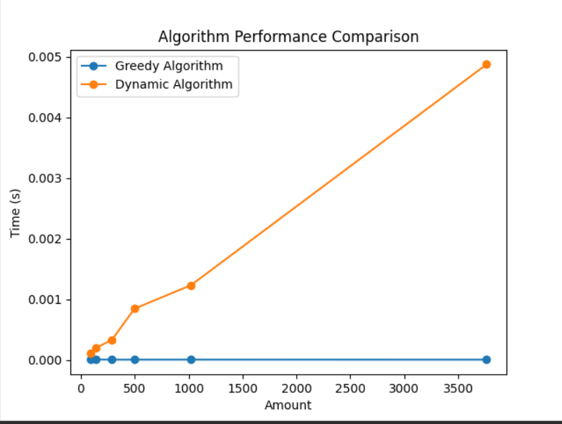

# SEARCH ALGORITM

Real & Fake Pattern.
| Algorithm | Real Substring (Text 1) | Fake Substring (Text 1) | Real Substring (Text 2) | Fake Substring (Text 2) |
|--------------------|---------------------------|---------------------------|---------------------------|---------------------------|
| Boyer-Moore | 0.000012 sec | 0.000318 sec | 0.000012 sec | 0.000444 sec |
| Knuth-Morris-Pratt | 0.000006 sec | 0.000654 sec | 0.000006 sec | 0.000929 sec |
| Rabin-Karp | 0.000012 sec | 0.001496 sec | 0.000012 sec | 0.002212 sec |
| String-Search | 0.000112 sec | 0.000003 sec | 0.000112 sec | 0.000002 sec |

Only Real Pattern.
| Algorithm | Real Substring (Text 1) | Fake Substring (Text 1) | Real Substring (Text 2) | Fake Substring (Text 2) |
|--------------------|---------------------------|---------------------------|---------------------------|---------------------------|
| Boyer-Moore | 0.000046 sec | - | 0.000046 sec | - |
| Knuth-Morris-Pratt | 0.000020 sec | - | 0.000020 sec | - |
| Rabin-Karp | 0.000026 sec | - | 0.000026 sec | - |
| String-Search | 0.000383 sec | - | 0.000383 sec | - |

Only Fake Pattern.
| Algorithm | Real Substring (Text 1) | Fake Substring (Text 1) | Real Substring (Text 2) | Fake Substring (Text 2) |
|--------------------|---------------------------|---------------------------|---------------------------|---------------------------|
| Boyer-Moore | - | 0.002874 sec | - | 0.002798 sec |
| Knuth-Morris-Pratt | - | 0.003539 sec | - | 0.004640 sec |
| Rabin-Karp | - | 0.009259 sec | - | 0.008551 sec |
| String-Search | - | 0.000020 sec | - | 0.000012 sec |

# SORT ALGORITM

Data Size: 100
Merge Sort: 7.074797758832574e-05 seconds
Insertion Sort: 7.066002581268549e-06 seconds
TimSort: 1.8739956431090832e-06 seconds

Data Size: 500
Merge Sort: 0.00035881303483620286 seconds
Insertion Sort: 2.6653986424207687e-05 seconds
TimSort: 1.8069986253976822e-06 seconds

Data Size: 1000
Merge Sort: 0.0007893230067566037 seconds
Insertion Sort: 4.7174980863928795e-05 seconds
TimSort: 3.0520022846758366e-06 seconds

Data Size: 3000
Merge Sort: 0.0027180559700354934 seconds
Insertion Sort: 0.0001345659838989377 seconds
TimSort: 7.612979970872402e-06 seconds

# BAG ALGORITM

Amount: 113, Greedy Result: {50: 2, 10: 1, 2: 1, 1: 1}, Dynamic Result: {50: 2, 10: 1, 2: 1, 1: 1}

| Amount | Greedy Algorithm Time (s) | Dynamic Algorithm Time (s) |
| -----: | ------------------------: | -------------------------: |
|    113 |                2.6226e-06 |                3.88622e-05 |

Amount: 87, Greedy Result: {50: 1, 25: 1, 10: 1, 2: 1}, Dynamic Result: {50: 1, 25: 1, 10: 1, 2: 1}

Amount: 143, Greedy Result: {50: 2, 25: 1, 10: 1, 5: 1, 2: 1, 1: 1}, Dynamic Result: {50: 2, 25: 1, 10: 1, 5: 1, 2: 1, 1: 1}

Amount: 289, Greedy Result: {50: 5, 25: 1, 10: 1, 2: 2}, Dynamic Result: {50: 5, 25: 1, 10: 1, 2: 2}

Amount: 498, Greedy Result: {50: 9, 25: 1, 10: 2, 2: 1, 1: 1}, Dynamic Result: {50: 9, 25: 1, 10: 2, 2: 1, 1: 1}

Amount: 1023, Greedy Result: {50: 20, 10: 2, 2: 1, 1: 1}, Dynamic Result: {50: 20, 10: 2, 2: 1, 1: 1}

Amount: 3764, Greedy Result: {50: 75, 10: 1, 2: 2}, Dynamic Result: {50: 75, 10: 1, 2: 2}

| Amount | Greedy Algorithm Time (s) | Dynamic Algorithm Time (s) |
| -----: | ------------------------: | -------------------------: |
|     87 |               1.33514e-05 |                0.000127077 |
|    143 |               7.39098e-06 |                0.000248432 |
|    289 |               4.29153e-06 |                0.000453949 |
|    498 |               4.76837e-06 |                0.000732183 |
|   1023 |               2.86102e-06 |                 0.00156784 |
|   3764 |               3.33786e-06 |                 0.00511575 |

