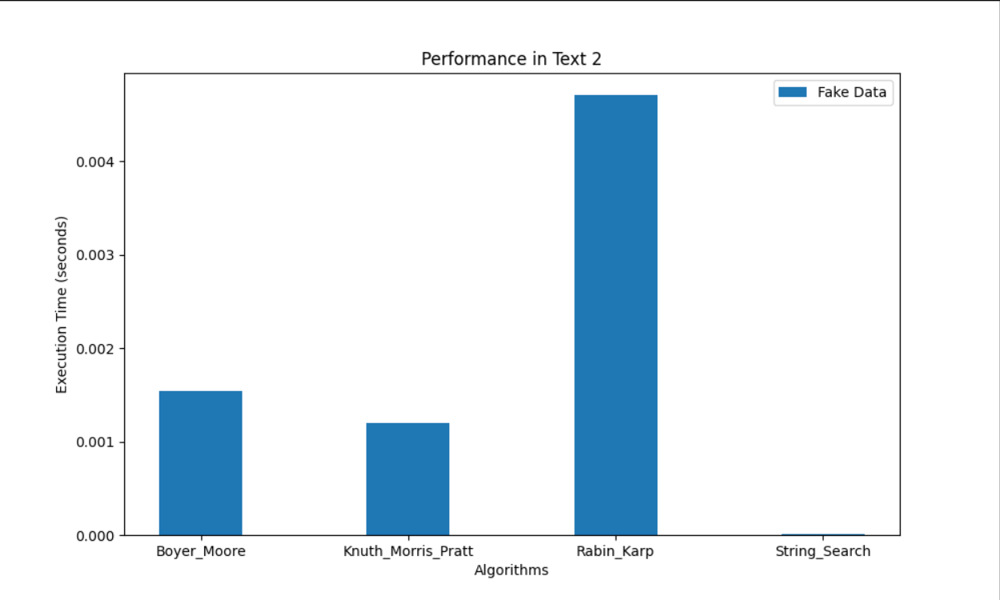

# SEARCH ALGORITM

Real & Fake Pattern.
| Algorithm | Real Substring (Text 1) | Fake Substring (Text 1) | Real Substring (Text 2) | Fake Substring (Text 2) |
|:-------------------|:--------------------------|:--------------------------|:--------------------------|:--------------------------|
| Boyer_Moore | 0.000012 sec | 0.000312 sec | 0.000003 sec | 0.000429 sec |
| Knuth_Morris_Pratt | 0.000007 sec | 0.000678 sec | 0.000007 sec | 0.000932 sec |
| Rabin_Karp | 0.000013 sec | 0.001516 sec | 0.000004 sec | 0.002235 sec |
| String_Search | 0.000110 sec | 0.000003 sec | 0.000142 sec | 0.000003 sec |

Only Real Pattern.
| Algorithm | Real Substring (Text 1) | Fake Substring (Text 1) | Real Substring (Text 2) | Fake Substring (Text 2) |
|:-------------------|:--------------------------|:--------------------------|:--------------------------|:--------------------------|
| Boyer_Moore | 0.000044 sec | - | 0.000011 sec | - |
| Knuth_Morris_Pratt | 0.000019 sec | - | 0.000009 sec | - |
| Rabin_Karp | 0.000024 sec | - | 0.000010 sec | - |
| String_Search | 0.000380 sec | - | 0.000464 sec | - |

Only Fake Pattern.
| Algorithm | Real Substring (Text 1) | Fake Substring (Text 1) | Real Substring (Text 2) | Fake Substring (Text 2) |
|:-------------------|:--------------------------|:--------------------------|:--------------------------|:--------------------------|
| Boyer_Moore | - | 0.001216 sec | - | 0.001216 sec |
| Knuth_Morris_Pratt | - | 0.002180 sec | - | 0.003429 sec |
| Rabin_Karp | - | 0.006202 sec | - | 0.004661 sec |
| String_Search | - | 0.000013 sec | - | 0.000008 sec |

# SORT ALGORITM

| Data Size |  Merge Sort | Insertion Sort |     TimSort |
| --------: | ----------: | -------------: | ----------: |
|       100 |  6.8939e-05 |    6.96897e-06 | 1.91102e-06 |
|       500 | 0.000376264 |     2.5464e-05 | 1.71701e-06 |
|      1000 | 0.000791304 |     4.4269e-05 | 3.01696e-06 |
|      3000 |  0.00277844 |    0.000127299 | 7.24697e-06 |

# BAG ALGORITM

| Amount | Greedy Result                           | Dynamic Result                          |
| -----: | :-------------------------------------- | :-------------------------------------- |
|     87 | {50: 1, 25: 1, 10: 1, 2: 1}             | {50: 1, 25: 1, 10: 1, 2: 1}             |
|    143 | {50: 2, 25: 1, 10: 1, 5: 1, 2: 1, 1: 1} | {50: 2, 25: 1, 10: 1, 5: 1, 2: 1, 1: 1} |
|    289 | {50: 5, 25: 1, 10: 1, 2: 2}             | {50: 5, 25: 1, 10: 1, 2: 2}             |
|    498 | {50: 9, 25: 1, 10: 2, 2: 1, 1: 1}       | {50: 9, 25: 1, 10: 2, 2: 1, 1: 1}       |
|   1023 | {50: 20, 10: 2, 2: 1, 1: 1}             | {50: 20, 10: 2, 2: 1, 1: 1}             |
|   3764 | {50: 75, 10: 1, 2: 2}                   | {50: 75, 10: 1, 2: 2}                   |

| Amount | Greedy Algorithm Time (s) | Dynamic Algorithm Time (s) |
| -----: | ------------------------: | -------------------------: |
|     87 |                1.4319e-05 |                0.000154262 |
|    143 |               7.53795e-06 |                 0.00026267 |
|    289 |               4.42803e-06 |                0.000485113 |
|    498 |               6.27298e-06 |                0.000905827 |
|   1023 |               5.67699e-06 |                 0.00198157 |
|   3764 |               5.16797e-06 |                 0.00854144 |

